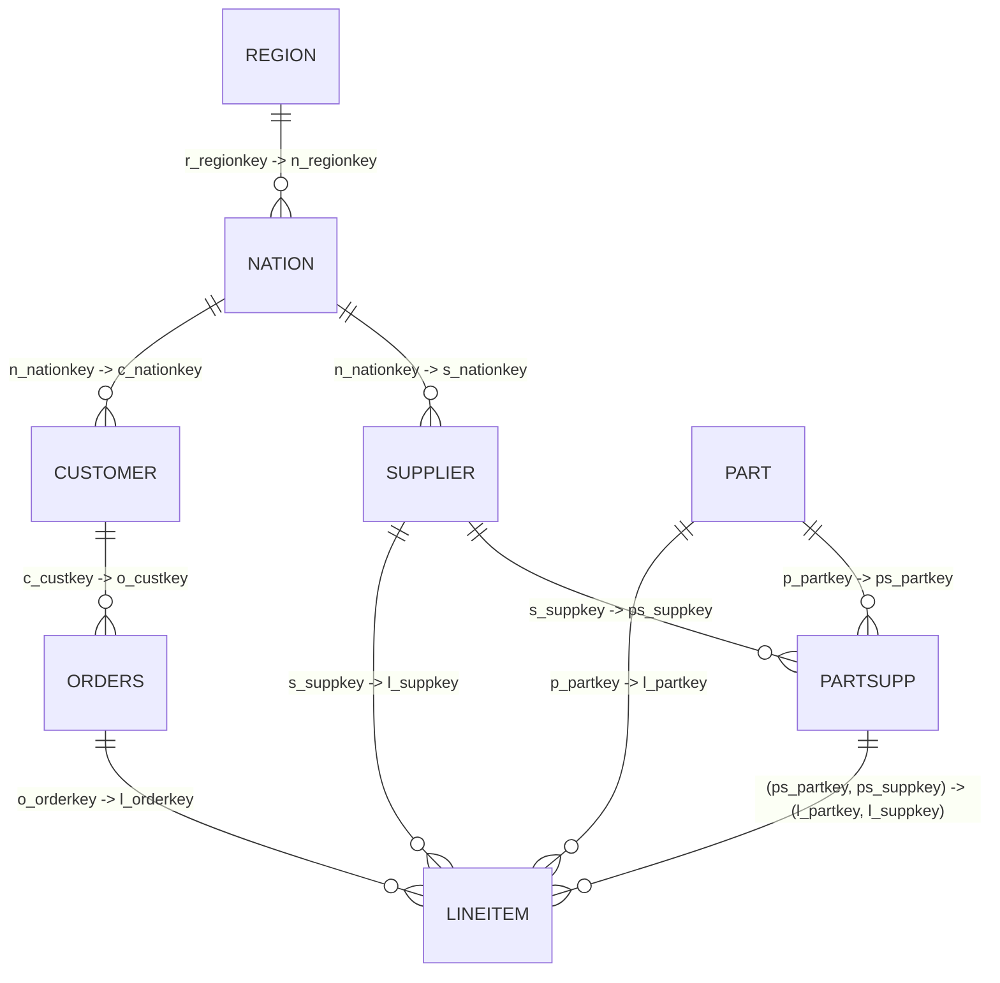

# TPC-H Benchmark Schema OKF (Open Knowledge Format)

This document provides a comprehensive specification of the **TPC-H Decision Support Benchmark Schema**, designed to assist agents and developers in generating valid queries, understanding data relationships, and managing database assets.

## 1. Schema Overview

The TPC-H schema is a third-normal-form (3NF) relational database design representing a global parts supplier business. It consists of **8 tables** representing regions, nations, suppliers, parts, customers, orders, and individual line items.



---

## 2. Table Definitions & Constraints

### 2.1 REGION
Contains regional data dividing the supplier market.

| Column | Type | Constraints | Description |
| :--- | :--- | :--- | :--- |
| `r_regionkey` | INTEGER | PRIMARY KEY | Unique identifier for the region |
| `r_name` | CHAR(25) | NOT NULL | Region name (e.g., ASIA, EUROPE, AMERICA) |
| `r_comment` | VARCHAR(152) | | Explanatory comments |

### 2.2 NATION
Contains national details mapped to a region.

| Column | Type | Constraints | Description |
| :--- | :--- | :--- | :--- |
| `n_nationkey` | INTEGER | PRIMARY KEY | Unique identifier for the nation |
| `n_name` | CHAR(25) | NOT NULL | Nation name (e.g., CANADA, CHINA, FRANCE) |
| `n_regionkey` | INTEGER | FOREIGN KEY | References [REGION.r_regionkey](file:///home/sprite/p/t/.agents/skills/tpch_schema/SKILL.md#L27) |
| `n_comment` | VARCHAR(152) | | Explanatory comments |

### 2.3 PART
Stores description of parts available for manufacturing/sale.

| Column | Type | Constraints | Description |
| :--- | :--- | :--- | :--- |
| `p_partkey` | INTEGER | PRIMARY KEY | Unique identifier for the part |
| `p_name` | VARCHAR(55) | NOT NULL | Part name |
| `p_mfgr` | CHAR(25) | NOT NULL | Manufacturer identifier |
| `p_brand` | CHAR(10) | NOT NULL | Part brand |
| `p_type` | VARCHAR(25) | NOT NULL | Part type category |
| `p_size` | INTEGER | NOT NULL | Size of the part |
| `p_container` | CHAR(10) | NOT NULL | Packaging container |
| `p_retailprice` | DECIMAL(15,2) | NOT NULL | Suggested retail price |
| `p_comment` | VARCHAR(23) | NOT NULL | Comments |

### 2.4 SUPPLIER
Stores info on companies that supply parts.

| Column | Type | Constraints | Description |
| :--- | :--- | :--- | :--- |
| `s_suppkey` | INTEGER | PRIMARY KEY | Unique identifier for the supplier |
| `s_name` | CHAR(25) | NOT NULL | Supplier name |
| `s_address` | VARCHAR(40) | NOT NULL | Supplier street address |
| `s_nationkey` | INTEGER | FOREIGN KEY | References [NATION.n_nationkey](file:///home/sprite/p/t/.agents/skills/tpch_schema/SKILL.md#L35) |
| `s_phone` | CHAR(15) | NOT NULL | Telephone number |
| `s_acctbal` | DECIMAL(15,2) | NOT NULL | Account balance |
| `s_comment` | VARCHAR(101) | NOT NULL | Comments |

### 2.5 PARTSUPP
Bridge table detailing which suppliers supply which parts and at what cost.

| Column | Type | Constraints | Description |
| :--- | :--- | :--- | :--- |
| `ps_partkey` | INTEGER | PRIMARY KEY, FOREIGN KEY | References [PART.p_partkey](file:///home/sprite/p/t/.agents/skills/tpch_schema/SKILL.md#L45) |
| `ps_suppkey` | INTEGER | PRIMARY KEY, FOREIGN KEY | References [SUPPLIER.s_suppkey](file:///home/sprite/p/t/.agents/skills/tpch_schema/SKILL.md#L59) |
| `ps_availqty` | INTEGER | NOT NULL | Available inventory quantity |
| `ps_supplycost` | DECIMAL(15,2) | NOT NULL | Unit cost from this supplier |
| `ps_comment` | VARCHAR(199) | NOT NULL | Inventory notes |

### 2.6 CUSTOMER
Stores information about customers placing orders.

| Column | Type | Constraints | Description |
| :--- | :--- | :--- | :--- |
| `c_custkey` | INTEGER | PRIMARY KEY | Unique identifier for the customer |
| `c_name` | VARCHAR(25) | NOT NULL | Customer name |
| `c_address` | VARCHAR(40) | NOT NULL | Customer street address |
| `c_nationkey` | INTEGER | FOREIGN KEY | References [NATION.n_nationkey](file:///home/sprite/p/t/.agents/skills/tpch_schema/SKILL.md#L35) |
| `c_phone` | CHAR(15) | NOT NULL | Telephone number |
| `c_acctbal` | DECIMAL(15,2) | NOT NULL | Account balance |
| `c_mktsegment` | CHAR(10) | NOT NULL | Market segment (e.g., HOUSEHOLD, AUTOMOBILE) |
| `c_comment` | VARCHAR(117) | NOT NULL | Profile comments |

### 2.7 ORDERS
Order header records representing transactions.

| Column | Type | Constraints | Description |
| :--- | :--- | :--- | :--- |
| `o_orderkey` | INTEGER | PRIMARY KEY | Unique identifier for the order |
| `o_custkey` | INTEGER | FOREIGN KEY | References [CUSTOMER.c_custkey](file:///home/sprite/p/t/.agents/skills/tpch_schema/SKILL.md#L83) |
| `o_orderstatus` | CHAR(1) | NOT NULL | Status code (e.g., 'O'pen, 'F'inished, 'P'ending) |
| `o_totalprice` | DECIMAL(15,2) | NOT NULL | Total cost of order |
| `o_orderdate` | DATE | NOT NULL | Date order was placed |
| `o_orderpriority`| CHAR(15) | NOT NULL | Priority rating (e.g., 1-URGENT) |
| `o_clerk` | CHAR(15) | NOT NULL | Salesperson name |
| `o_shippriority` | INTEGER | NOT NULL | Delivery priority rating |
| `o_comment` | VARCHAR(79) | NOT NULL | Clerk notes |

### 2.8 LINEITEM
Granular order line items detailing parts bought in a transaction.

| Column | Type | Constraints | Description |
| :--- | :--- | :--- | :--- |
| `l_orderkey` | INTEGER | PRIMARY KEY, FOREIGN KEY | References [ORDERS.o_orderkey](file:///home/sprite/p/t/.agents/skills/tpch_schema/SKILL.md#L95) |
| `l_partkey` | INTEGER | FOREIGN KEY | References [PART.p_partkey](file:///home/sprite/p/t/.agents/skills/tpch_schema/SKILL.md#L45) |
| `l_suppkey` | INTEGER | FOREIGN KEY | References [SUPPLIER.s_suppkey](file:///home/sprite/p/t/.agents/skills/tpch_schema/SKILL.md#L59) |
| `l_linenumber` | INTEGER | PRIMARY KEY | Line item number within the order |
| `l_quantity` | DECIMAL(15,2) | NOT NULL | Units purchased |
| `l_extendedprice`| DECIMAL(15,2) | NOT NULL | Raw subtotal (quantity * unit price) |
| `l_discount` | DECIMAL(15,2) | NOT NULL | Applied discount percentage (e.g. 0.05) |
| `l_tax` | DECIMAL(15,2) | NOT NULL | Applied tax percentage |
| `l_returnflag` | CHAR(1) | NOT NULL | Return code (e.g., 'R'eturned, 'A'ccepted) |
| `l_linestatus` | CHAR(1) | NOT NULL | Line status code |
| `l_shipdate` | DATE | NOT NULL | Date sent to customer |
| `l_commitdate` | DATE | NOT NULL | Commitment fulfillment date |
| `l_receiptdate` | DATE | NOT NULL | Delivery date to customer |
| `l_shipinstruct` | CHAR(25) | NOT NULL | Logistics instruction (e.g., DELIVER IN PERSON) |
| `l_shipmode` | CHAR(10) | NOT NULL | Logistics transportation mode (e.g., AIR, SHIP) |
| `l_comment` | VARCHAR(44) | NOT NULL | Line item comments |

---

## 3. Key Relationships and Joins

When writing queries for TPC-H benchmarks, keep the following direct
relationship paths in mind to optimize join performance:

1. **Order to Item Details:**
   ```sql
   FROM orders o
   JOIN lineitem l ON o.o_orderkey = l.l_orderkey
   ```
2. **Item to Inventory & Supplier:**
   ```sql
   FROM lineitem l
   JOIN partsupp ps ON l.l_partkey = ps.ps_partkey AND l.l_suppkey = ps.ps_suppkey
   JOIN supplier s ON l.l_suppkey = s.s_suppkey
   ```
3. **Geographic Distribution:**
   ```sql
   FROM customer c
   JOIN nation n ON c.c_nationkey = n.n_nationkey
   JOIN region r ON n.n_regionkey = r.r_regionkey
   ```
